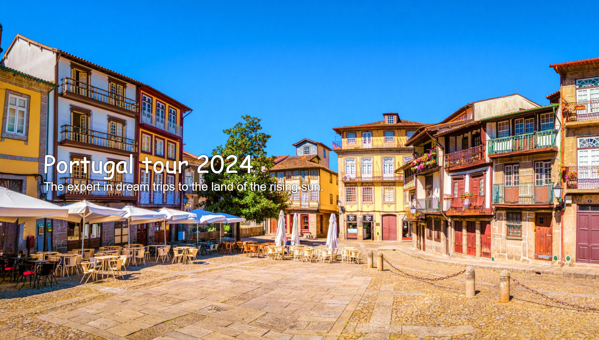
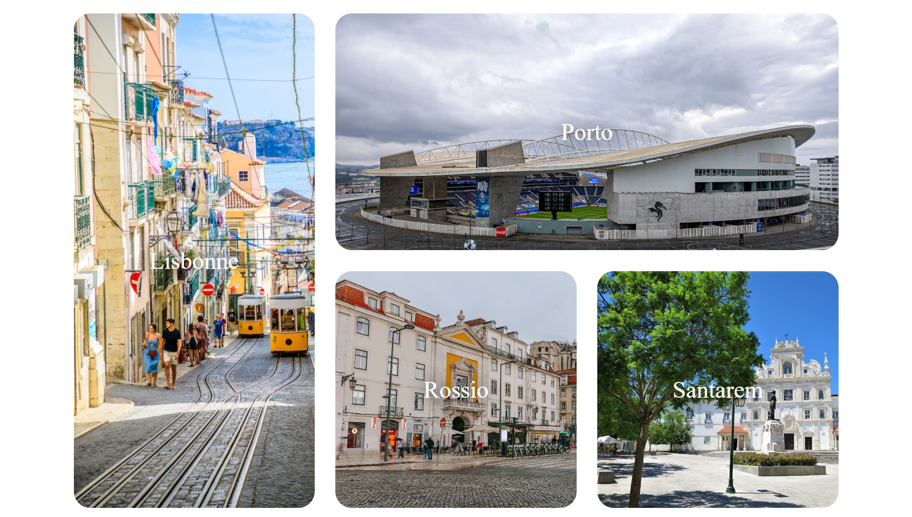

🇵🇹 **Portugal Tour 2024**  
*Un projet personnel inspiré de mes vacances d’été passées au Portugal.*

Ce site web présente une sélection de destinations portugaises qui m’ont marqué lors de mon voyage en 2023. J’ai voulu retranscrire à travers une maquette colorée et responsive l’ambiance chaleureuse des villes traversées, tout en m'exerçant aux bases du HTML et du CSS.

---

🖼️ **Aperçu visuel du site**

---

🌍 **Destinations visitées et présentées**

- **Lisbonne** – le charme des ruelles anciennes et des tramways jaunes  
- **Porto** – une ville dynamique avec une architecture moderne et historique  
- **Rossio** – quartier emblématique au cœur de Lisbonne  
- **Santarém** – petit village paisible au patrimoine impressionnant  

🧭 Le site propose une section “Top Destinations” avec des images interactives représentant chaque lieu visité.

---

🎯 **Objectifs du projet**

- Utiliser des balises HTML5 sémantiques
- Structurer une page touristique dynamique
- Travailler l’intégration d’images et le design responsive
- Proposer un aperçu personnel d’un circuit touristique réel

---

📌 **Projet réalisé en autonomie, en souvenir d’un road trip personnel**  
🌐 Technologies utilisées : `HTML` | `CSS` (sans framework)

